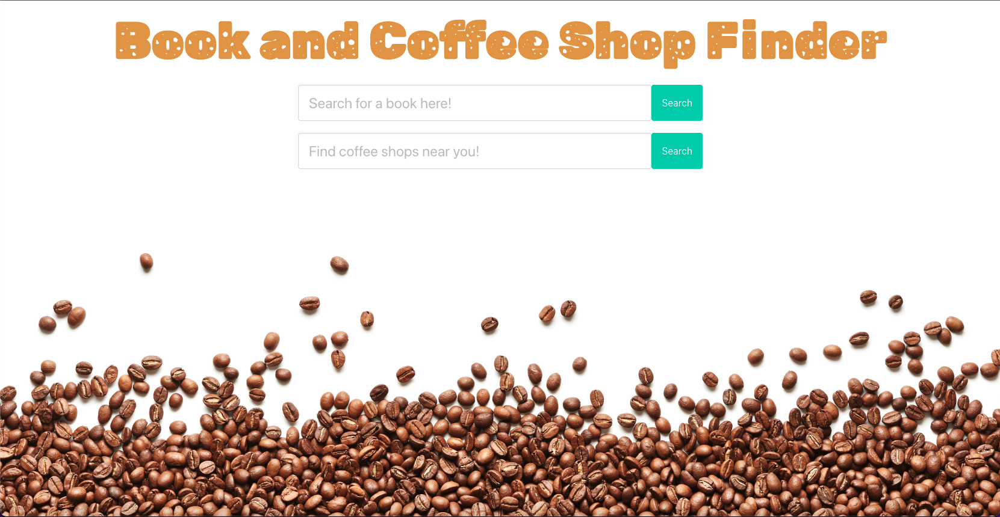
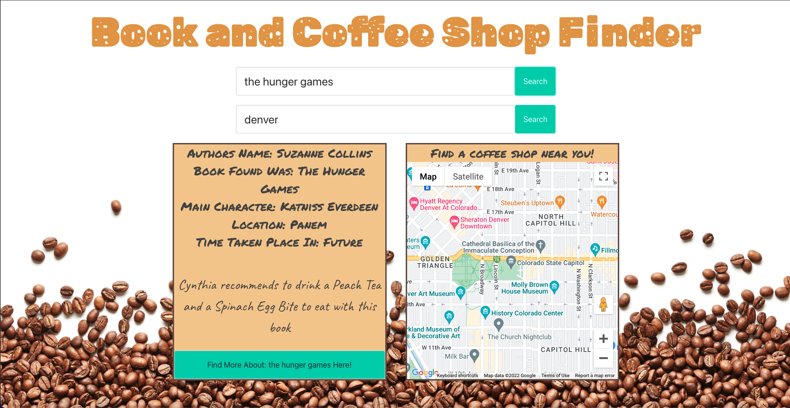

# Coffee-and-Book-Finder

## Project Description

An application for finding books & coffee shop locations.

## Deployment | Main Objective

The main objective of this project is to learn how to effectively collaborate with
other developers on a web application that is hosted on GitHub. To avoid conflict
multiple branches are created within a single project. When conflicts arise we can
learn how to deal with them as a collective.

## What is Used

    * index.html
    * script.js
    * style.css
    * (x2) Third-Party API's
    * Use a CSS Framework other than Bootstrap
    * Google Slides (pitch book)

## Third-Party API's

[Google Geolocation](https://developers.google.com/maps/documentation/geolocation/get-api-key)

[Open Library](https://www.programmableweb.com/api/open-library-books-rest-api)

[OpenWeather One Call API](https://openweathermap.org/api/one-call-api) Used for Longitude and Latitude Only

## CSS Framework Used

[Bulma](https://bulma.io/)

## How to Use the Project

✅ The main page of the application with allow a user to find a book & a unique coffee shop location.

✅ When a book is searched, the book will pull up from `Open Library`.

✅ When a book is searched, a recommended coffee and food item will display.

✅ When the "Find out more about this book" button is clicked, the `Open Library` will open in a new page about that book.

✅ When a new book is searched, the "Find out more about this book" button will refresh/clear.

✅ When a location is given, a list of coffee shops will pull up from `Google Geolocation`.

## Live URL

https://Noah8863.github.io/Coffee-and-Book-Finder/

## Presentation | Google Slides
https://docs.google.com/presentation/d/13RwvT0qLVmkHSeG3fJg3Ka1LvPxJya6YTOZlf4SAQ_s/edit?usp=sharing

## Screenshots

